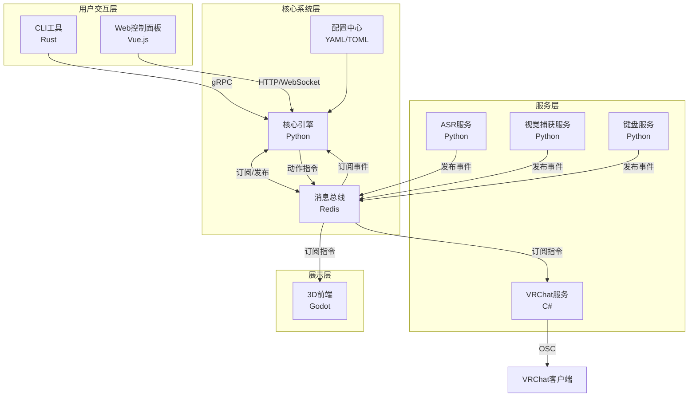
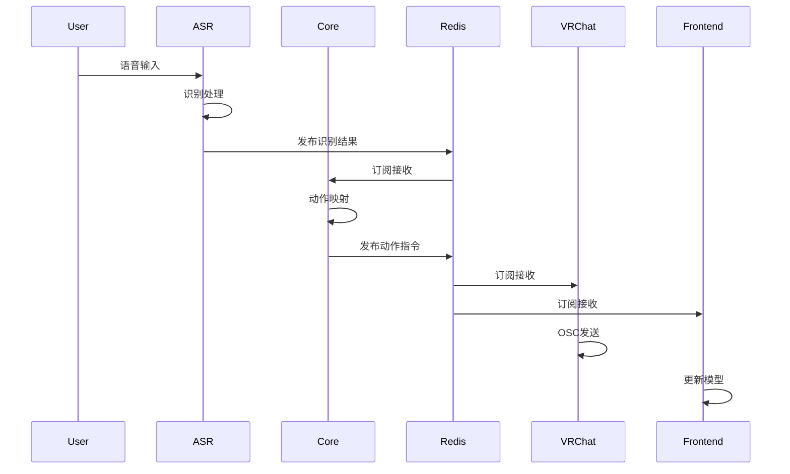
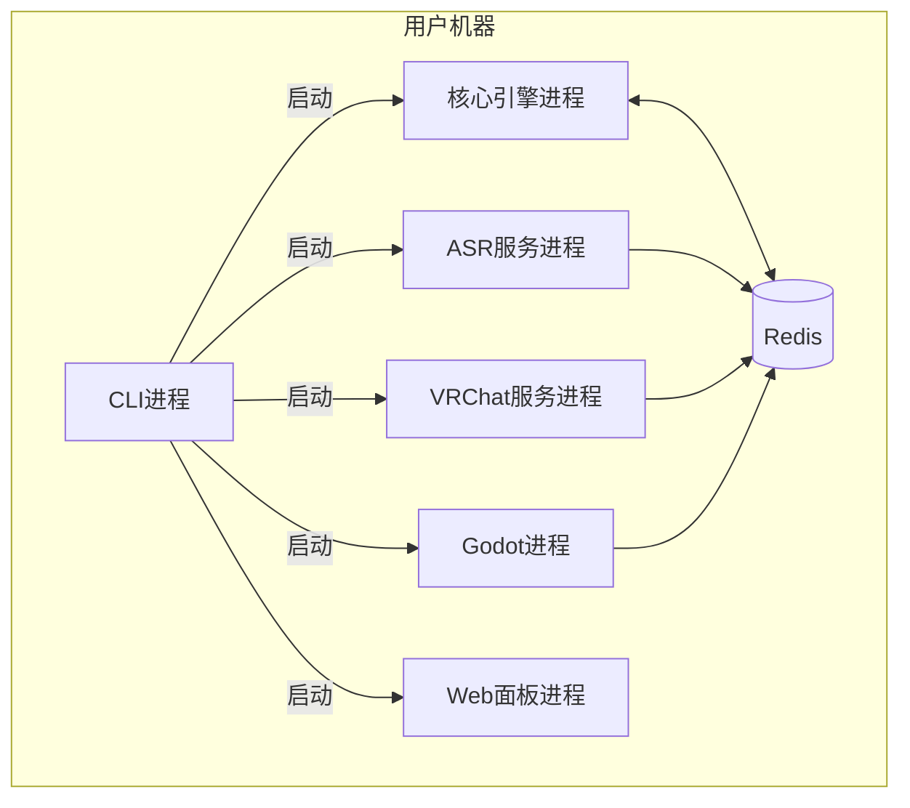

# 技术设计说明

## 1. 设计概述

### 1.1 设计目标
- 构建一个模块化、可扩展的多语言混合系统架构
- 实现各技术栈组件间的松耦合和高效通信
- 提供统一的配置管理和部署体验
- 确保系统的可维护性和可测试性

### 1.2 设计原则
- **模块化**: 每个功能模块独立开发、独立部署、独立扩展
- **松耦合**: 模块间通过定义良好的接口通信,降低依赖
- **异步优先**: 使用异步通信模式提高系统响应性
- **配置驱动**: 核心行为通过配置文件控制,避免硬编码
- **渐进增强**: 核心功能优先,扩展功能可选

### 1.3 技术选型

| 技术栈 | 选型 | 理由 |
|--------|------|------|
| CLI工具 | Rust | 高性能、跨平台、单文件分发、零依赖运行时 |
| 核心逻辑 | Python | 丰富的AI/ML生态、快速开发、易于集成 |
| 3D前端 | Godot 4.0 | 开源、跨平台、内置VRM支持、轻量级 |
| VRChat对接 | C# | VRChat SDK官方支持、OSC协议成熟 |
| Web面板 | Vue.js 3 | 响应式、组件化、生态完善 |
| 通信协议 | gRPC + Redis | 高性能RPC、消息队列解耦 |
| 配置格式 | YAML + TOML | 人类可读、类型安全、工具支持好 |

## 2. 系统架构

### 2.1 整体架构
采用**微内核架构(Microkernel Architecture)**,核心系统提供基础服务,各功能模块以插件形式加载。

架构特点:
- 核心系统负责模块加载、配置管理、消息路由
- 各服务模块独立进程,通过消息队列通信
- CLI作为系统入口,负责初始化和编排
- Web面板作为管理接口,提供监控和配置能力

### 2.2 架构图



### 2.3 组件说明

| 组件 | 技术栈 | 职责 | 通信方式 |
|------|--------|------|----------|
| CLI工具 | Rust | 系统初始化、服务编排、配置管理 | gRPC调用核心 |
| 核心引擎 | Python | 业务逻辑、状态管理、事件路由 | gRPC服务端、Redis客户端 |
| 消息总线 | Redis | 异步消息传递、事件解耦 | Redis Pub/Sub |
| ASR服务 | Python | 语音识别、音频处理 | Redis发布事件 |
| 视觉服务 | Python | 面部追踪、表情映射 | Redis发布事件 |
| VRChat服务 | C# | VRChat对接、OSC通信 | Redis订阅指令、OSC发送 |
| 键盘服务 | Python | 快捷键监听、指令触发 | Redis发布事件 |
| 3D前端 | Godot | 模型渲染、动作播放 | Redis订阅指令 |
| Web面板 | Vue.js | 配置管理、状态监控 | HTTP/WebSocket |

## 3. 模块设计

### 3.1 CLI工具模块 (Rust)

#### 3.1.1 模块职责
- 解析命令行参数和配置文件
- 检测系统环境和依赖
- 启动和管理各服务进程
- 提供交互式配置向导

#### 3.1.2 接口设计

**命令接口**:
```rust
// 部署命令
fn deploy(config: DeployConfig) -> Result<(), Error>

// 启动服务
fn start(service: ServiceName) -> Result<(), Error>

// 停止服务
fn stop(service: ServiceName) -> Result<(), Error>

// 配置管理
fn config(action: ConfigAction) -> Result<(), Error>

// 状态查询
fn status() -> Result<SystemStatus, Error>
```

**配置结构**:
```rust
struct DeployConfig {
    services: Vec<ServiceName>,
    mode: DeployMode,  // dev, prod
    config_path: PathBuf,
}

struct SystemStatus {
    services: HashMap<ServiceName, ServiceStatus>,
    version: String,
    uptime: Duration,
}
```

#### 3.1.3 数据模型
- **服务配置**: TOML格式,定义服务启动参数
- **环境配置**: YAML格式,定义系统环境变量
- **进程状态**: 内存结构,跟踪各服务进程状态

#### 3.1.4 依赖关系
- 依赖: `clap`(命令行解析)、`tokio`(异步运行时)、`serde`(序列化)
- 被依赖: 无(作为系统入口)

### 3.2 核心引擎模块 (Python)

#### 3.2.1 模块职责
- 实现核心业务逻辑(动作映射、状态管理)
- 提供gRPC服务接口
- 管理消息订阅和路由
- 协调各服务模块的工作流

#### 3.2.2 接口设计

**gRPC服务接口**:
```python
# 系统控制接口
class SystemService:
    def start(self, request: StartRequest) -> StartResponse
    def stop(self, request: StopRequest) -> StopResponse
    def get_status(self) -> SystemStatus

# 配置管理接口
class ConfigService:
    def get_config(self, key: str) -> ConfigValue
    def set_config(self, key: str, value: Any) -> None
    def validate_config(self, config: Dict) -> ValidationResult

# 动作管理接口
class ActionService:
    def trigger_action(self, action: ActionRequest) -> ActionResult
    def get_action_mapping(self, trigger: str) -> ActionMapping
    def register_action(self, action: ActionDefinition) -> None
```

**内部接口**:
```python
# 事件处理器
class EventHandler:
    def on_asr_result(self, text: str, confidence: float)
    def on_vision_update(self, face_data: FaceData)
    def on_keyboard_event(self, key: str, action: str)

# 状态管理器
class StateManager:
    def get_state(self, key: str) -> Any
    def set_state(self, key: str, value: Any) -> None
    def subscribe(self, key: str, callback: Callable) -> None
```

#### 3.2.3 数据模型

**动作映射模型**:
```python
@dataclass
class ActionMapping:
    trigger: str              # 触发条件(语音关键词/快捷键)
    action_type: ActionType   # 动作类型(表情/动作/参数)
    parameters: Dict[str, Any]  # 动作参数
    priority: int             # 优先级
    cooldown: float           # 冷却时间(秒)
```

**系统状态模型**:
```python
@dataclass
class SystemState:
    mode: SystemMode          # 运行模式
    active_services: Set[str] # 活跃服务
    current_action: Optional[str]  # 当前动作
    model_state: ModelState   # 模型状态
    vrchat_state: VRChatState # VRChat连接状态
```

#### 3.2.4 依赖关系
- 依赖: `grpcio`(gRPC)、`redis`(消息队列)、`pydantic`(数据验证)
- 被依赖: CLI工具、Web面板、所有服务模块

### 3.3 ASR服务模块 (Python)

#### 3.3.1 模块职责
- 连接ASR引擎(Whisper/Azure Speech等)
- 接收音频流并进行识别
- 发布识别结果到消息队列
- 管理音频设备和格式转换

#### 3.3.2 接口设计

```python
class ASRService:
    def __init__(self, engine: ASREngine, config: ASRConfig)
    
    async def start_listening(self) -> None
    async def stop_listening(self) -> None
    
    async def process_audio(self, audio: AudioChunk) -> None
    def on_result(self, callback: Callable[[ASRResult], None]) -> None

@dataclass
class ASRResult:
    text: str
    confidence: float
    is_final: bool
    timestamp: float
```

#### 3.3.3 数据模型
- **音频配置**: 采样率、格式、设备ID
- **识别结果**: 文本、置信度、时间戳
- **引擎配置**: API密钥、模型路径、语言设置

#### 3.3.4 依赖关系
- 依赖: `redis`(发布结果)、`pyaudio`(音频采集)、ASR引擎SDK
- 被依赖: 核心引擎(通过消息队列)

### 3.4 VRChat服务模块 (C#)

#### 3.4.1 模块职责
- 检测和连接VRChat进程
- 通过OSC协议控制VRChat参数
- 订阅动作指令并转换为OSC消息
- 管理VRChat参数映射配置

#### 3.4.2 接口设计

```csharp
public class VRChatService {
    public async Task ConnectAsync(string vrchatPath);
    public async Task DisconnectAsync();
    
    public void SendParameter(string paramName, float value);
    public void SendParameter(string paramName, int value);
    public void SendParameter(string paramName, bool value);
    
    public void SetAvatarParameter(string paramName, object value);
    public async Task<VRChatState> GetStateAsync();
}

public class OSCClient {
    public void Send(string address, params object[] values);
    public void Subscribe(string address, Action<OSCMessage> handler);
}
```

#### 3.4.3 数据模型

**参数映射配置**:
```csharp
public class ParameterMapping {
    public string ActionName { get; set; }
    public string OSCAddress { get; set; }
    public ParameterType Type { get; set; }
    public float MinValue { get; set; }
    public float MaxValue { get; set; }
    public float TransitionTime { get; set; }
}
```

#### 3.4.4 依赖关系
- 依赖: `Rug.Osc`(OSC库)、`redis`(订阅指令)
- 被依赖: 核心引擎(通过消息队列)

### 3.5 3D前端模块 (Godot)

#### 3.5.1 模块职责
- 加载和渲染Live2D/VRM模型
- 接收动作指令并更新模型
- 提供模型预览和调试界面
- 管理模型资源和动画状态

#### 3.5.2 接口设计

**GDScript接口**:
```gdscript
# 模型管理器
class_name ModelManager extends Node

func load_model(path: String) -> void
func unload_model() -> void
func get_model_info() -> Dictionary

# 动作控制器
class_name ActionController extends Node

func play_action(action_name: String, params: Dictionary = {}) -> void
func set_parameter(param_name: String, value: float) -> void
func set_expression(expr_name: String, intensity: float) -> void
func stop_action() -> void

# 通信接口
class_name NetworkClient extends Node

func connect_to_core(address: String) -> void
func subscribe_action_channel() -> void
func send_heartbeat() -> void
```

#### 3.5.3 数据模型

**模型状态**:
```gdscript
var model_state = {
    "is_loaded": false,
    "model_type": "",  # "live2d" or "vrm"
    "current_action": "",
    "parameters": {},
    "expressions": {}
}
```

#### 3.5.4 依赖关系
- 依赖: Live2D插件、VRM插件、`redis`(订阅指令)
- 被依赖: Web面板(嵌入预览)

### 3.6 Web控制面板模块 (Vue.js)

#### 3.6.1 模块职责
- 提供配置管理界面
- 实时显示系统状态和日志
- 提供模型预览和测试功能
- 用户认证和权限管理

#### 3.6.2 接口设计

**API接口**:
```typescript
// 系统控制
POST /api/system/start
POST /api/system/stop
GET /api/system/status

// 配置管理
GET /api/config/:key
PUT /api/config/:key
POST /api/config/validate
GET /api/config/export
POST /api/config/import

// 动作管理
GET /api/actions
POST /api/actions/trigger
PUT /api/actions/mapping

// 日志查询
GET /api/logs?level=&start=&end=
WebSocket /ws/logs  // 实时日志流

// 状态监控
WebSocket /ws/status  // 实时状态推送
```

**组件结构**:
```typescript
// 页面组件
- DashboardView      // 仪表盘
- ConfigView         // 配置管理
- ActionView         // 动作管理
- LogView            // 日志查看
- ModelPreviewView   // 模型预览

// 核心组件
- ServiceStatusCard  // 服务状态卡片
- ConfigEditor       // 配置编辑器
- ActionMapper       // 动作映射配置
- LogViewer          // 日志查看器
- ModelViewer        // 3D模型查看器
```

#### 3.6.3 数据模型

**前端状态管理**:
```typescript
interface AppState {
  system: {
    status: SystemStatus;
    services: ServiceStatus[];
  };
  config: {
    current: Config;
    history: Config[];
  };
  logs: LogEntry[];
  model: ModelState;
}
```

#### 3.6.4 依赖关系
- 依赖: `vue-router`、`pinia`(状态管理)、`element-plus`(UI库)、`axios`(HTTP)
- 被依赖: 用户(通过浏览器)

## 4. 数据设计

### 4.1 数据模型

#### 系统配置
```yaml
# config.yaml
system:
  mode: production
  log_level: INFO
  
services:
  asr:
    enabled: true
    engine: whisper
    model: base
  vision:
    enabled: false
    device: 0
  vrchat:
    enabled: true
    osc_port: 9000
  keyboard:
    enabled: true
    
messaging:
  redis:
    host: localhost
    port: 6379
    db: 0
    
web:
  host: 0.0.0.0
  port: 8080
  auth:
    enabled: true
    secret: ${WEB_AUTH_SECRET}
```

#### 动作映射配置
```yaml
# action_mapping.yaml
mappings:
  - trigger: "你好"
    action: wave
    parameters:
      intensity: 0.8
    cooldown: 2.0
    
  - trigger: "谢谢"
    action: bow
    parameters:
      duration: 1.5
      
  - trigger: "ctrl+shift+h"
    action: happy
    parameters:
      expression: joy
      intensity: 1.0
```

#### VRChat参数映射
```yaml
# vrchat_params.yaml
parameters:
  wave:
    - address: "/avatar/parameters/GestureLeft"
      value: 1
    - address: "/avatar/parameters/GestureLeftWeight"
      value: 0.8
      
  happy:
    - address: "/avatar/parameters/VRCFaceExpression"
      value: "happy"
```

### 4.2 数据存储

| 数据类型 | 存储方式 | 位置 | 说明 |
|---------|---------|------|------|
| 系统配置 | YAML文件 | `config/` | 启动时加载,支持热重载 |
| 动作映射 | YAML文件 | `config/mappings/` | 支持版本管理 |
| 运行状态 | Redis | 内存 | 实时状态,支持持久化 |
| 日志数据 | 文件 + Redis | `logs/` | 文件持久化,Redis实时流 |
| 用户数据 | SQLite | `data/users.db` | Web面板用户信息 |
| 模型资源 | 文件系统 | `models/` | Live2D/VRM模型文件 |

### 4.3 数据流



## 5. 接口设计

### 5.1 内部接口

#### gRPC接口 (核心引擎)

**系统控制服务**:
```protobuf
service SystemService {
  rpc Start(StartRequest) returns (StartResponse);
  rpc Stop(StopRequest) returns (StopResponse);
  rpc GetStatus(Empty) returns (SystemStatus);
  rpc Restart(RestartRequest) returns (RestartResponse);
}

message StartRequest {
  repeated string services = 1;
  bool force = 2;
}

message SystemStatus {
  map<string, ServiceStatus> services = 1;
  string version = 2;
  int64 uptime = 3;
}
```

**配置管理服务**:
```protobuf
service ConfigService {
  rpc Get(GetRequest) returns (ConfigValue);
  rpc Set(SetRequest) returns (Empty);
  rpc Validate(ValidateRequest) returns (ValidateResponse);
  rpc Export(ExportRequest) returns (ConfigData);
  rpc Import(ImportRequest) returns (ImportResponse);
}
```

#### Redis消息接口

**频道定义**:
```
asr:result        # ASR识别结果
vision:update     # 视觉追踪更新
keyboard:event    # 键盘事件
action:trigger    # 动作触发指令
action:complete   # 动作完成通知
state:change      # 状态变更通知
log:stream        # 日志流
```

**消息格式**:
```json
{
  "type": "asr_result",
  "timestamp": 1234567890.123,
  "data": {
    "text": "你好",
    "confidence": 0.95,
    "is_final": true
  }
}
```

### 5.2 外部接口

#### Web API (控制面板)

**系统控制**:
```
POST /api/system/start
请求: { "services": ["asr", "vrchat"] }
响应: { "code": 0, "message": "started" }

GET /api/system/status
响应: {
  "code": 0,
  "data": {
    "services": { "asr": "running", "vrchat": "running" },
    "uptime": 3600
  }
}
```

**配置管理**:
```
GET /api/config/system
响应: { "code": 0, "data": { ... } }

PUT /api/config/system
请求: { "mode": "production", ... }
响应: { "code": 0, "message": "updated" }
```

#### WebSocket接口

**实时状态流**:
```
连接: ws://localhost:8080/ws/status
消息: {
  "type": "status_update",
  "data": { "service": "asr", "status": "running" }
}
```

**实时日志流**:
```
连接: ws://localhost:8080/ws/logs
消息: {
  "type": "log",
  "data": {
    "level": "INFO",
    "message": "ASR service started",
    "timestamp": 1234567890
  }
}
```

### 5.3 API规范

- **认证**: JWT Token,通过`Authorization: Bearer <token>`传递
- **错误码**: 
  - 0: 成功
  - 1xxx: 客户端错误(参数错误、认证失败等)
  - 2xxx: 服务端错误(内部错误、服务不可用等)
- **分页**: 使用`page`和`page_size`参数
- **排序**: 使用`sort`和`order`参数
- **过滤**: 使用查询参数进行字段过滤

## 6. 技术实现

### 6.1 关键技术

#### 跨语言通信
- **gRPC**: CLI与核心引擎的同步通信
- **Redis Pub/Sub**: 服务模块间的异步消息传递
- **WebSocket**: Web面板的实时数据推送

#### 进程管理
- **Rust**: 使用`tokio`进行异步进程管理
- **Python**: 使用`asyncio`进行异步服务
- **进程监控**: 心跳检测、自动重启

#### 配置管理
- **多层配置**: 默认配置 < 文件配置 < 环境变量 < 命令行参数
- **热重载**: 使用文件监听实现配置热更新
- **验证**: 使用`pydantic`进行配置验证

### 6.2 技术难点

#### 难点1: 多语言进程协调
**问题**: 不同语言实现的进程需要统一管理和协调
**解决方案**:
- CLI作为主进程,负责启动和监控子进程
- 使用Redis作为消息总线,解耦进程间通信
- 实现健康检查和自动重启机制

#### 难点2: 实时性能优化
**问题**: 语音识别到动作执行的延迟需要控制在100ms内
**解决方案**:
- 使用Redis的PUB/SUB实现零延迟消息传递
- 核心引擎使用异步处理,避免阻塞
- 动作映射使用内存缓存,避免IO

#### 难点3: VRChat连接稳定性
**问题**: VRChat可能随时启动/退出,需要自动重连
**解决方案**:
- 实现进程检测和自动发现
- 使用指数退避重连策略
- 状态持久化,重连后恢复状态

### 6.3 解决方案

#### 模块加载机制
```python
# 核心引擎的模块加载器
class ModuleLoader:
    def __init__(self):
        self.modules = {}
        
    async def load_module(self, name: str, config: Dict):
        module = import_module(f"modules.{name}")
        instance = module.Module(config)
        await instance.initialize()
        self.modules[name] = instance
        
    async def unload_module(self, name: str):
        await self.modules[name].shutdown()
        del self.modules[name]
```

#### 动作映射引擎
```python
class ActionMapper:
    def __init__(self, config: Dict):
        self.mappings = self._load_mappings(config)
        self.cooldowns = {}
        
    def map_trigger(self, trigger: str) -> Optional[Action]:
        # 检查冷却时间
        if self._in_cooldown(trigger):
            return None
            
        # 查找映射
        for mapping in self.mappings:
            if self._match(trigger, mapping.trigger):
                self._set_cooldown(trigger, mapping.cooldown)
                return Action(
                    type=mapping.action_type,
                    params=mapping.parameters
                )
        return None
```

## 7. 部署设计

### 7.1 部署架构



### 7.2 环境配置

**环境变量**:
```bash
# 核心配置
SWARMCLONE_MODE=production
SWARMCLONE_CONFIG_PATH=/path/to/config

# Redis配置
REDIS_HOST=localhost
REDIS_PORT=6379
REDIS_PASSWORD=

# ASR配置
ASR_ENGINE=whisper
ASR_MODEL=base
ASR_API_KEY=

# VRChat配置
VRCHAT_OSC_PORT=9000
VRCHAT_OSC_ADDRESS=127.0.0.1

# Web面板配置
WEB_HOST=0.0.0.0
WEB_PORT=8080
WEB_AUTH_SECRET=
```

### 7.3 容器化方案

**Docker Compose配置**:
```yaml
version: '3.8'

services:
  redis:
    image: redis:7-alpine
    ports:
      - "6379:6379"
      
  core:
    build:
      context: ./core
      dockerfile: Dockerfile
    depends_on:
      - redis
    environment:
      - REDIS_HOST=redis
    volumes:
      - ./config:/app/config
      - ./logs:/app/logs
      
  asr:
    build:
      context: ./services/asr
      dockerfile: Dockerfile
    depends_on:
      - redis
      - core
    environment:
      - REDIS_HOST=redis
      
  web:
    build:
      context: ./panel
      dockerfile: Dockerfile
    ports:
      - "8080:8080"
    depends_on:
      - core
```

## 8. 安全设计

### 8.1 认证授权

**Web面板认证**:
- 使用JWT进行用户认证
- Token有效期: 24小时
- 支持Token刷新机制
- 密码使用bcrypt加密存储

**API鉴权**:
```python
# 中间件验证
@middleware
async def auth_middleware(request, handler):
    token = request.headers.get("Authorization")
    if not validate_token(token):
        return JSONResponse({"code": 1001, "message": "Unauthorized"}, 401)
    return await handler(request)
```

### 8.2 数据安全

**敏感信息保护**:
- API密钥等敏感配置使用环境变量
- 配置文件中的敏感字段加密存储
- 日志中脱敏处理敏感信息

**加密方案**:
```python
from cryptography.fernet import Fernet

class ConfigEncryption:
    def __init__(self, key: bytes):
        self.fernet = Fernet(key)
        
    def encrypt(self, value: str) -> str:
        return self.fernet.encrypt(value.encode()).decode()
        
    def decrypt(self, value: str) -> str:
        return self.fernet.decrypt(value.encode()).decode()
```

### 8.3 安全策略

- **输入验证**: 所有外部输入进行严格验证
- **SQL注入防护**: 使用参数化查询
- **XSS防护**: 前端使用Vue.js自动转义
- **CSRF防护**: 使用CSRF Token
- **速率限制**: API请求频率限制
- **审计日志**: 记录所有关键操作

## 9. 性能设计

### 9.1 性能目标

| 指标 | 目标值 | 测量方法 |
|------|--------|----------|
| 动作响应延迟 | < 100ms | 从触发到执行的端到端延迟 |
| 消息传递延迟 | < 10ms | Redis PUB/SUB延迟 |
| 模型渲染帧率 | ≥ 30fps | Godot帧率统计 |
| API响应时间 | < 200ms | HTTP请求响应时间 |
| 内存占用 | < 500MB | 系统总内存占用 |
| CPU占用 | < 30% | 空闲状态CPU占用 |

### 9.2 优化策略

#### 异步处理
- 所有IO操作使用异步
- 使用`asyncio`/`tokio`进行并发
- 避免阻塞主线程

#### 缓存策略
- 动作映射规则内存缓存
- 配置数据内存缓存
- Redis作为共享缓存

#### 批处理优化
- 音频数据批量处理
- 日志批量写入
- 状态批量更新

### 9.3 监控指标

**系统指标**:
- CPU、内存、磁盘使用率
- 进程数量和状态
- 网络IO统计

**业务指标**:
- 动作触发次数和延迟
- ASR识别准确率
- VRChat连接稳定性
- API请求QPS和延迟

**监控实现**:
```python
from prometheus_client import Counter, Histogram, Gauge

# 定义指标
action_counter = Counter('action_triggered_total', 'Total actions triggered')
action_latency = Histogram('action_latency_seconds', 'Action latency')
service_status = Gauge('service_status', 'Service status', ['service'])

# 记录指标
def record_action(action: str, latency: float):
    action_counter.inc()
    action_latency.observe(latency)
```

## 10. 扩展性设计

### 10.1 扩展点

**服务扩展**:
- 新增服务模块只需实现标准接口
- 通过配置启用/禁用服务
- 支持第三方服务集成

**动作扩展**:
- 支持自定义动作类型
- 支持动作脚本(JavaScript/Lua)
- 支持动作组合和序列

**模型扩展**:
- 支持新的模型格式(通过插件)
- 支持自定义渲染管线
- 支持模型资源远程加载

### 10.2 插件机制

**插件接口**:
```python
class PluginInterface(ABC):
    @abstractmethod
    async def initialize(self, config: Dict) -> None:
        pass
        
    @abstractmethod
    async def shutdown(self) -> None:
        pass
        
    @abstractmethod
    def get_name(self) -> str:
        pass
```

**插件加载**:
```python
class PluginManager:
    def __init__(self, plugin_dir: str):
        self.plugins = {}
        self.plugin_dir = plugin_dir
        
    async def load_plugins(self):
        for path in Path(self.plugin_dir).glob("*.py"):
            module = import_module(path.stem)
            plugin = module.Plugin()
            await plugin.initialize({})
            self.plugins[plugin.get_name()] = plugin
```

### 10.3 版本演进

**版本策略**:
- 主版本号: 架构重大变更
- 次版本号: 新增功能
- 修订号: Bug修复

**兼容性保证**:
- API向后兼容
- 配置文件版本迁移
- 数据格式版本管理

**升级路径**:
```
v1.0 -> v1.1: 配置文件自动迁移
v1.x -> v2.0: 提供迁移脚本和文档
```
