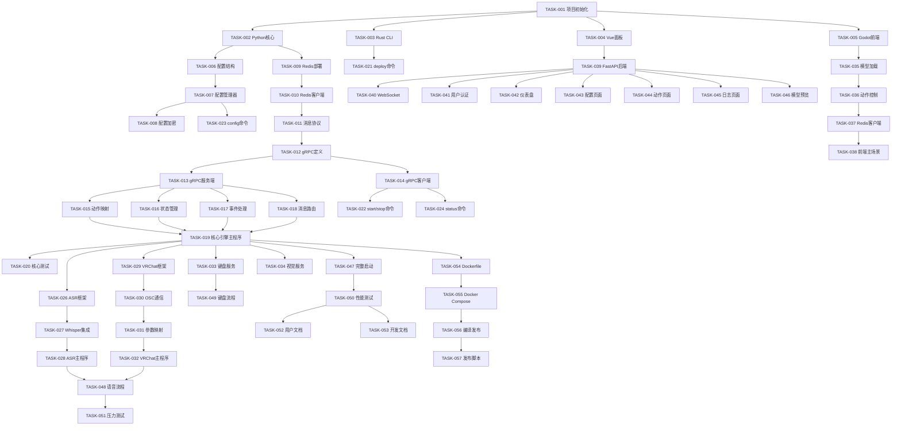

# 开发任务清单

## 任务概览
本文档基于需求规格(spec.md)和技术设计(design.md)生成,按照模块和优先级组织开发任务。

---

## 阶段一: 基础架构搭建 (优先级: 高)

### 1.1 项目初始化
- [ ] **TASK-001**: 创建项目目录结构
  - 创建cli/、core/、frontend/、panel/、scripts/、services/目录
  - 创建config/、logs/、data/、models/数据目录
  - 创建.gitignore和README.md
  - 验收标准: 目录结构符合设计文档规范

- [ ] **TASK-002**: 初始化Python核心模块
  - 创建core/Python项目,配置pyproject.toml
  - 安装核心依赖: grpcio, redis, pydantic, loguru, asyncio
  - 创建基础包结构: core/{engine, services, models, utils}
  - 验收标准: 项目可正常导入和运行

- [ ] **TASK-003**: 初始化Rust CLI项目
  - 使用cargo init初始化cli/项目
  - 配置Cargo.toml,添加clap, tokio, serde依赖
  - 创建基础命令结构: deploy, start, stop, config, status
  - 验收标准: cargo build成功,可执行基本命令

- [ ] **TASK-004**: 初始化Vue.js Web面板
  - 使用npm create vue@latest创建panel/项目
  - 安装依赖: vue-router, pinia, element-plus, axios
  - 创建基础页面结构: Dashboard, Config, Action, Log
  - 验收标准: npm run dev成功启动开发服务器

- [ ] **TASK-005**: 初始化Godot前端项目
  - 创建Godot 4.0项目在frontend/目录
  - 配置项目设置,安装VRM和Live2D插件
  - 创建基础场景和节点结构
  - 验收标准: 项目可在Godot编辑器中打开

### 1.2 配置系统实现
- [ ] **TASK-006**: 实现配置文件结构
  - 创建config.yaml主配置模板
  - 创建action_mapping.yaml动作映射模板
  - 创建vrchat_params.yaml参数映射模板
  - 实现配置验证schema
  - 验收标准: 配置文件格式正确,验证通过

- [ ] **TASK-007**: 实现Python配置管理器
  - 实现ConfigManager类,支持YAML/TOML加载
  - 实现多层配置合并(默认<文件<环境变量<命令行)
  - 实现配置热重载和验证
  - 验收标准: 配置加载、验证、热重载功能正常

- [ ] **TASK-008**: 实现配置加密功能
  - 使用cryptography库实现敏感信息加密
  - 实现环境变量注入机制
  - 实现配置脱敏显示
  - 验收标准: 敏感信息加密存储,解密正确

### 1.3 消息总线搭建
- [ ] **TASK-009**: 部署Redis服务
  - 编写Docker Compose配置
  - 配置Redis连接参数
  - 实现Redis健康检查
  - 验收标准: Redis服务正常启动和连接

- [ ] **TASK-010**: 实现Python Redis客户端
  - 封装Redis连接池管理
  - 实现Pub/Sub消息发布和订阅
  - 实现消息序列化和反序列化
  - 验收标准: 消息发布订阅功能正常

- [ ] **TASK-011**: 定义消息协议
  - 定义消息频道: asr:result, vision:update, action:trigger等
  - 定义消息格式schema
  - 实现消息类型验证
  - 验收标准: 消息格式规范,类型安全

---

## 阶段二: 核心引擎开发 (优先级: 高)

### 2.1 gRPC服务实现
- [ ] **TASK-012**: 定义gRPC接口
  - 编写system.proto定义系统控制接口
  - 编写config.proto定义配置管理接口
  - 编写action.proto定义动作管理接口
  - 验收标准: proto文件编译成功

- [ ] **TASK-013**: 实现gRPC服务端
  - 实现SystemService服务
  - 实现ConfigService服务
  - 实现ActionService服务
  - 配置gRPC服务器和拦截器
  - 验收标准: gRPC服务可正常启动和调用

- [ ] **TASK-014**: 实现gRPC客户端(Rust)
  - 使用tonic生成Rust客户端代码
  - 封装CLI的gRPC调用接口
  - 实现连接管理和错误处理
  - 验收标准: CLI可通过gRPC调用核心服务

### 2.2 核心业务逻辑
- [ ] **TASK-015**: 实现动作映射引擎
  - 实现ActionMapper类
  - 实现触发条件匹配(关键词、快捷键)
  - 实现冷却时间管理
  - 实现动作优先级排序
  - 验收标准: 动作映射功能正确,延迟<10ms

- [ ] **TASK-016**: 实现状态管理器
  - 实现StateManager类
  - 实现状态的内存存储和持久化
  - 实现状态变更通知机制
  - 实现状态查询接口
  - 验收标准: 状态管理功能完整,线程安全

- [ ] **TASK-017**: 实现事件处理器
  - 实现EventHandler基类
  - 实现ASR结果处理
  - 实现视觉数据处理
  - 实现键盘事件处理
  - 验收标准: 事件处理流程正确

- [ ] **TASK-018**: 实现消息路由器
  - 实现MessageRouter类
  - 订阅Redis消息频道
  - 分发消息到对应处理器
  - 实现消息过滤和转换
  - 验收标准: 消息路由正确,无丢失

### 2.3 核心引擎集成
- [ ] **TASK-019**: 实现核心引擎主程序
  - 整合gRPC服务、消息路由、状态管理
  - 实现优雅启动和关闭
  - 实现健康检查接口
  - 配置日志和监控
  - 验收标准: 核心引擎可独立运行

- [ ] **TASK-020**: 编写核心引擎测试
  - 编写单元测试(动作映射、状态管理)
  - 编写集成测试(gRPC接口、消息流)
  - 配置pytest和覆盖率报告
  - 验收标准: 测试覆盖率>80%

---

## 阶段三: CLI工具开发 (优先级: 高)

### 3.1 命令实现
- [ ] **TASK-021**: 实现deploy命令
  - 实现系统环境检测
  - 实现依赖安装逻辑
  - 实现配置文件生成
  - 实现进度显示和错误处理
  - 验收标准: deploy命令可完成环境初始化

- [ ] **TASK-022**: 实现start/stop命令
  - 实现服务进程启动
  - 实现依赖顺序管理
  - 实现进程监控和重启
  - 实现优雅停止
  - 验收标准: 服务可正常启动和停止

- [ ] **TASK-023**: 实现config命令
  - 实现交互式配置向导
  - 实现配置验证和编辑
  - 实现配置导入导出
  - 验收标准: 配置管理功能完整

- [ ] **TASK-024**: 实现status命令
  - 实现服务状态查询
  - 实现状态格式化输出
  - 实现实时状态监控
  - 验收标准: 状态显示准确

### 3.2 CLI集成测试
- [ ] **TASK-025**: 编写CLI测试
  - 编写命令行参数解析测试
  - 编写服务管理集成测试
  - 配置CI/CD构建流程
  - 验收标准: 所有命令测试通过

---

## 阶段四: 服务模块开发 (优先级: 高)

### 4.1 ASR服务
- [ ] **TASK-026**: 实现ASR服务基础框架
  - 创建services/asr/Python项目
  - 实现ASRService基类
  - 实现音频设备管理
  - 验收标准: ASR服务框架可运行

- [ ] **TASK-027**: 集成Whisper引擎
  - 实现WhisperEngine适配器
  - 实现音频流处理
  - 实现识别结果发布
  - 验收标准: Whisper识别功能正常

- [ ] **TASK-028**: 实现ASR服务主程序
  - 整合音频采集、识别、结果发布
  - 实现服务配置和启动
  - 实现健康检查
  - 验收标准: ASR服务可独立运行

### 4.2 VRChat服务
- [ ] **TASK-029**: 实现VRChat服务基础框架
  - 创建services/vrchat/C#项目
  - 实现VRChatService类
  - 实现进程检测和连接
  - 验收标准: VRChat服务框架可运行

- [ ] **TASK-030**: 实现OSC通信
  - 集成Rug.Osc库
  - 实现OSCClient封装
  - 实现参数发送和接收
  - 验收标准: OSC通信功能正常

- [ ] **TASK-031**: 实现参数映射
  - 实现参数映射配置加载
  - 实现动作到OSC参数转换
  - 实现参数平滑过渡
  - 验收标准: 参数映射正确

- [ ] **TASK-032**: 实现VRChat服务主程序
  - 整合连接管理、OSC通信、参数映射
  - 实现Redis订阅和指令处理
  - 实现自动重连机制
  - 验收标准: VRChat服务可独立运行

### 4.3 键盘服务
- [ ] **TASK-033**: 实现键盘服务
  - 创建services/keyboard/Python项目
  - 使用pynput实现全局热键监听
  - 实现快捷键配置和触发
  - 实现Redis事件发布
  - 验收标准: 快捷键监听和触发正常

### 4.4 视觉服务(可选)
- [ ] **TASK-034**: 实现视觉捕获服务
  - 创建services/vision/Python项目
  - 集成OpenCV进行面部追踪
  - 实现表情参数映射
  - 实现Redis事件发布
  - 验收标准: 面部追踪和表情映射正常

---

## 阶段五: 3D前端开发 (优先级: 中)

### 5.1 模型管理
- [ ] **TASK-035**: 实现模型加载器
  - 实现ModelManager GDScript类
  - 实现Live2D模型加载
  - 实现VRM模型加载
  - 实现模型资源管理
  - 验收标准: 模型可正确加载和显示

- [ ] **TASK-036**: 实现动作控制器
  - 实现ActionController类
  - 实现动作播放和停止
  - 实现参数设置
  - 实现表情控制
  - 验收标准: 动作和表情控制正常

### 5.2 通信集成
- [ ] **TASK-037**: 实现Redis客户端(GDScript)
  - 使用GDScript实现Redis连接
  - 实现消息订阅
  - 实现动作指令处理
  - 验收标准: 可接收和处理动作指令

- [ ] **TASK-038**: 实现前端主场景
  - 创建主场景和UI
  - 整合模型管理和通信
  - 实现调试界面
  - 验收标准: 前端可独立运行

---

## 阶段六: Web控制面板开发 (优先级: 中)

### 6.1 后端API
- [ ] **TASK-039**: 实现FastAPI后端
  - 创建panel/backend/项目
  - 实现系统控制API
  - 实现配置管理API
  - 实现日志查询API
  - 验收标准: API接口功能完整

- [ ] **TASK-040**: 实现WebSocket服务
  - 实现实时状态推送
  - 实现实时日志流
  - 实现心跳和重连
  - 验收标准: WebSocket通信正常

- [ ] **TASK-041**: 实现用户认证
  - 实现JWT认证
  - 实现用户管理
  - 实现权限控制
  - 验收标准: 认证和授权功能正常

### 6.2 前端界面
- [ ] **TASK-042**: 实现仪表盘页面
  - 实现服务状态卡片
  - 实现性能指标图表
  - 实现实时数据更新
  - 验收标准: 仪表盘显示正确

- [ ] **TASK-043**: 实现配置管理页面
  - 实现配置编辑器组件
  - 实现配置验证和保存
  - 实现配置导入导出
  - 验收标准: 配置管理功能完整

- [ ] **TASK-044**: 实现动作管理页面
  - 实现动作映射配置界面
  - 实现动作测试功能
  - 实现动作预览
  - 验收标准: 动作管理功能完整

- [ ] **TASK-045**: 实现日志查看页面
  - 实现日志列表和过滤
  - 实现实时日志流
  - 实现日志导出
  - 验收标准: 日志查看功能完整

- [ ] **TASK-046**: 实现模型预览页面
  - 集成Godot模型查看器
  - 实现参数调节界面
  - 实现动作测试
  - 验收标准: 模型预览功能正常

---

## 阶段七: 集成与测试 (优先级: 高)

### 7.1 端到端集成
- [ ] **TASK-047**: 实现完整启动流程
  - CLI启动所有服务
  - 服务间通信验证
  - 状态同步验证
  - 验收标准: 系统可完整启动和运行

- [ ] **TASK-048**: 实现语音到动作流程
  - ASR识别 → 核心映射 → VRChat执行
  - ASR识别 → 核心映射 → 前端显示
  - 验证延迟和准确性
  - 验收标准: 端到端延迟<100ms

- [ ] **TASK-049**: 实现键盘到动作流程
  - 键盘触发 → 核心映射 → 动作执行
  - 验证快捷键响应
  - 验收标准: 快捷键响应正常

### 7.2 性能测试
- [ ] **TASK-050**: 性能基准测试
  - 测试动作映射延迟
  - 测试消息传递延迟
  - 测试系统资源占用
  - 验收标准: 满足性能目标

- [ ] **TASK-051**: 压力测试
  - 测试高频率动作触发
  - 测试长时间运行稳定性
  - 测试异常恢复能力
  - 验收标准: 系统稳定可靠

### 7.3 文档编写
- [ ] **TASK-052**: 编写用户文档
  - 编写安装部署指南
  - 编写配置说明文档
  - 编写使用教程
  - 验收标准: 文档清晰完整

- [ ] **TASK-053**: 编写开发文档
  - 编写架构设计文档
  - 编写API接口文档
  - 编写贡献指南
  - 验收标准: 文档便于开发和维护

---

## 阶段八: 部署与发布 (优先级: 中)

### 8.1 容器化
- [ ] **TASK-054**: 编写Dockerfile
  - 编写core/Dockerfile
  - 编写services/*/Dockerfile
  - 编写panel/Dockerfile
  - 验收标准: 镜像构建成功

- [ ] **TASK-055**: 完善Docker Compose
  - 配置服务依赖关系
  - 配置网络和存储
  - 配置环境变量
  - 验收标准: docker-compose up成功

### 8.2 发布准备
- [ ] **TASK-056**: 编译发布版本
  - 编译Rust CLI可执行文件
  - 打包Python项目
  - 构建Web面板生产版本
  - 验收标准: 发布包完整

- [ ] **TASK-057**: 编写发布脚本
  - 编写自动化发布脚本
  - 编写版本更新脚本
  - 编写回滚脚本
  - 验收标准: 发布流程自动化

---

## 任务依赖关系

---

## 任务统计

- **总任务数**: 57个
- **高优先级**: 35个
- **中优先级**: 22个
- **预计工作量**: 约4-6周(单人开发)

## 开发建议

1. **按阶段推进**: 严格按照阶段顺序开发,确保基础架构稳定
2. **优先核心功能**: 先完成高优先级任务,确保核心功能可用
3. **持续集成**: 每完成一个模块立即进行集成测试
4. **文档同步**: 开发过程中同步更新文档
5. **性能监控**: 从开发初期就关注性能指标
